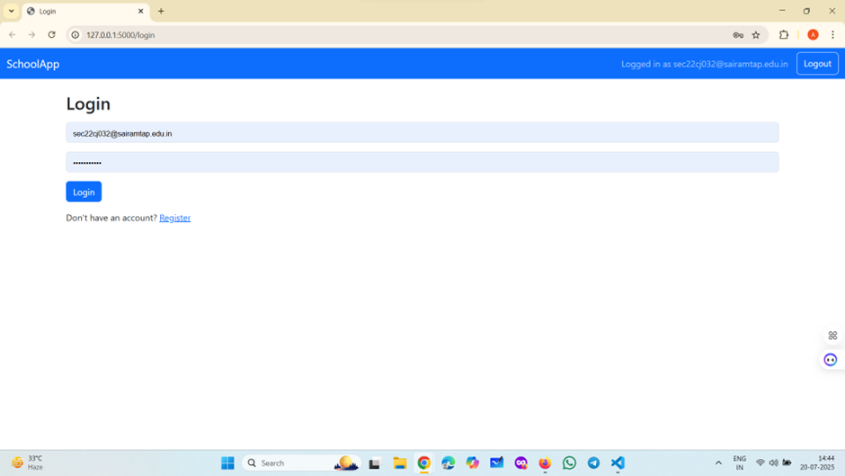

# 📝 Flask Assignment Submission Portal

A simple web-based assignment portal where **teachers** can create assignments and **students** can submit their responses. Built using Python, Flask, SQLite, and Bootstrap.

---

## 🚀 Features

### 👨‍🏫 For Teachers:
- Register/Login securely
- Create assignments
- View student submissions
- Grade submitted assignments
- View assignments they’ve created

### 👨‍🎓 For Students:
- Register/Login securely
- View available assignments
- Submit answers to assignments
- (Optional) View received grades

---

## 📁 Project Structure

project/
│
├── app.py # Main Flask app
├── database.db # SQLite DB (auto-created)
├── requirements.txt # Python dependencies
├── .gitignore
│
├── templates/ # HTML templates
│ ├── layout.html
│ ├── login.html
│ ├── signup.html
│ ├── create_assignment.html
│ ├── submit_assignment.html
│ ├── view_submissions.html
│ └── my_assignments.html
│
└── static/ # Static files (optional)
└── style.css

yaml
Copy
Edit

---

## 🛠 Installation

### 1. Clone the Repo

```bash
git clone https://github.com/<your-username>/flask-assignment-app.git
cd flask-assignment-app
2. Create Virtual Environment (optional but recommended)
bash
Copy
Edit
python -m venv venv
source venv/bin/activate   # On Windows: venv\Scripts\activate
3. Install Requirements
bash
Copy
Edit
pip install -r requirements.txt
4. Run the App
bash
Copy
Edit
python app.py
Visit http://127.0.0.1:5000 in your browser.

🧪 Example Logins
Role	Username	Password
Teacher	teacher1	password1
Student	student1	password2

(Register these accounts manually first)

Screenshot of Students page:
